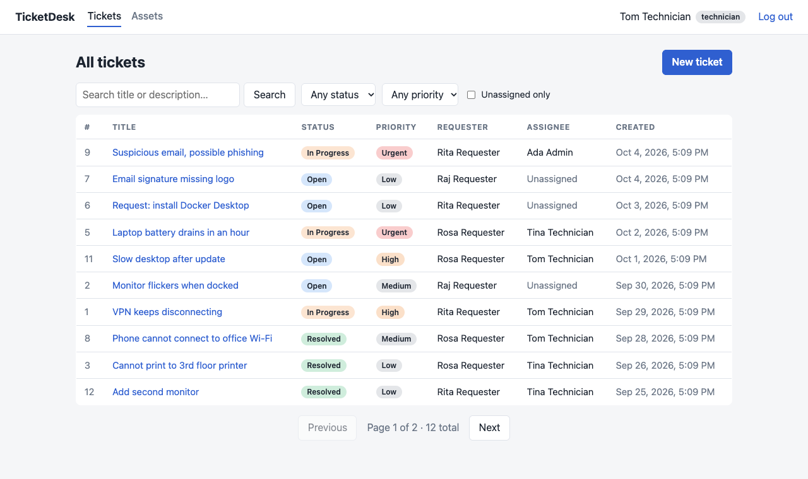
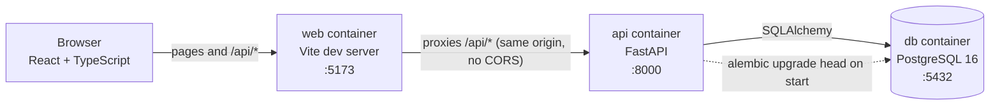
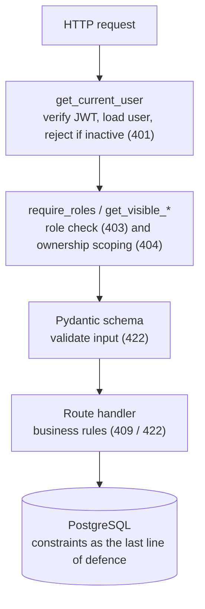
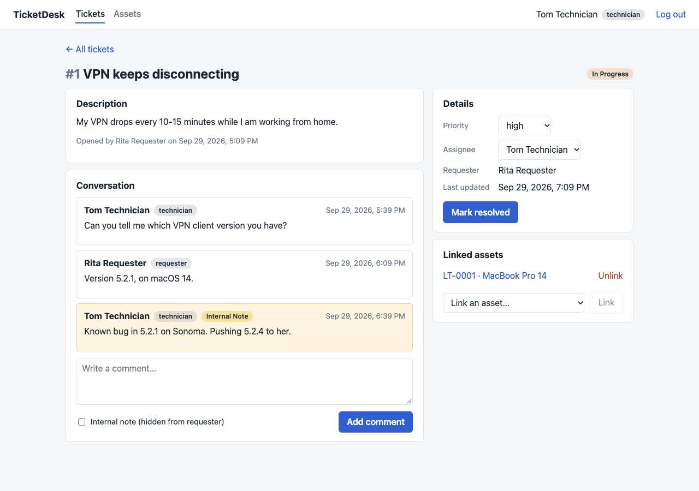
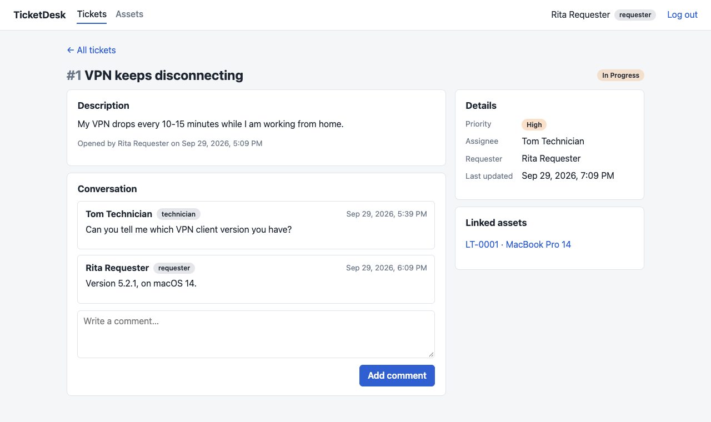
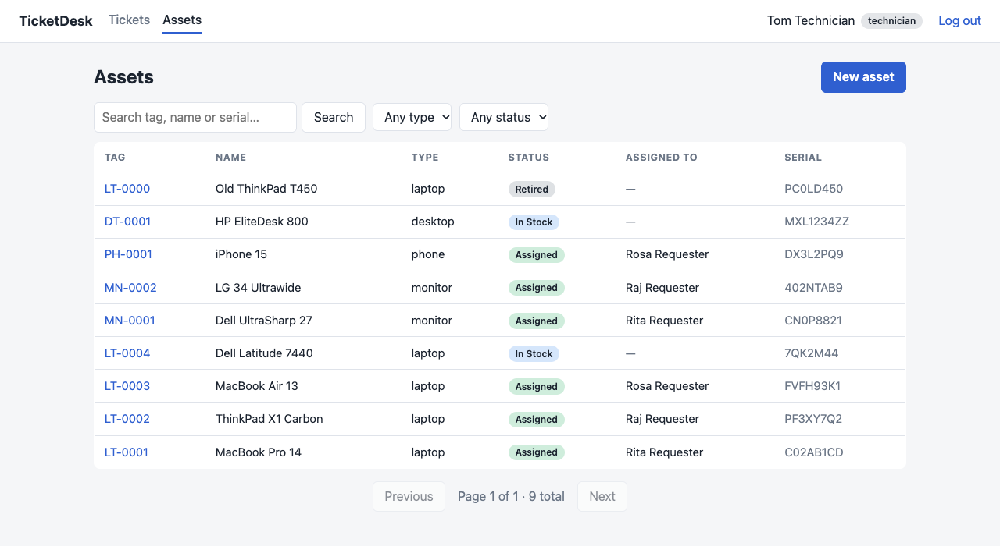
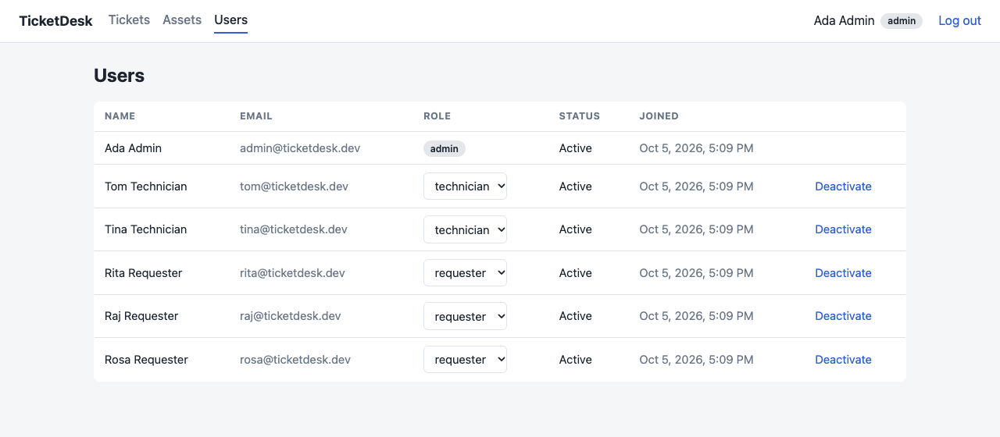

# TicketDesk

[](https://github.com/coutLiKe/ticketdesk/actions/workflows/ci.yml)

An IT help-desk and asset tracker. Employees raise tickets, technicians work them, admins
manage people, and every device is tracked and linked to the tickets it causes.

Built as a portfolio project: FastAPI + PostgreSQL + React, fully containerised, with
role-based access control enforced on every endpoint and a test suite that checks the
permission rules, not just the happy paths.



## Features

- **Three roles**: requester, technician, admin. JWT login. Signup always creates a
  requester; only an admin can change roles.
- **Tickets**: create, assign, set priority, comment, and move through
  `open → in_progress → resolved → closed` (a resolved ticket can be reopened). Filter by
  status, priority and assignee, search, and paginate.
- **Internal notes**: technicians can leave comments that requesters never see.
- **Assets**: track laptops, monitors and phones, assign them to people, retire them, and link
  them to tickets (many-to-many).
- **Free and open source only**: no paid services and no API keys.

## Quick start

You need [Docker](https://www.docker.com/products/docker-desktop/) (Docker Desktop or
OrbStack). It runs on Apple Silicon and Intel.

```bash
git clone https://github.com/coutLiKe/ticketdesk.git && cd ticketdesk
cp .env.example .env
docker compose up --build
```

In a second terminal, load the demo data:

```bash
docker compose run --rm seed
```

| What | Where |
|---|---|
| App | http://localhost:5173 |
| API docs (Swagger) | http://localhost:8000/docs |
| Postgres | localhost:5432 (user, password and database: `ticketdesk`) |

Demo logins (password for all: `demo1234`):

| Role | Email |
|---|---|
| admin | `admin@ticketdesk.dev` |
| technician | `tom@ticketdesk.dev`, `tina@ticketdesk.dev` |
| requester | `rita@ticketdesk.dev`, `raj@ticketdesk.dev`, `rosa@ticketdesk.dev` |

Start over with an empty database: `docker compose down -v`.

> The seed script uses a published password. Never run it against a real deployment, and set
> your own `SECRET_KEY` (`openssl rand -hex 32`) anywhere beyond local development.

## Architecture



Inside the API, every request passes through the same layers:



Project layout:

```
backend/
  app/
    main.py            app + router registration
    config.py          settings from environment variables
    db.py              engine, session, constraint naming convention
    models.py          SQLAlchemy models and enums
    schemas.py         Pydantic request/response models
    security.py        password hashing (bcrypt) and JWT helpers
    deps.py            get_current_user, require_roles, StaffUser
    ticket_rules.py    ticket state machine and status permissions (pure functions)
    routers/           auth, users, tickets, comments, assets, ticket_assets
    seed.py            idempotent demo data (never for production)
    make_admin.py      promote a registered user to admin (first admin in production)
    ratelimit.py       in-memory failed-login limiter
    cors.py            CORS setup from the CORS_ORIGINS setting
  alembic/versions/    database migrations
  tests/               pytest suite (real PostgreSQL)
frontend/src/          React app: pages/, components/, api.ts, auth.tsx
docs/                  screenshots and the M4 comments spec
scripts/               screenshot generator
```

## Permissions

| Action | Requester | Technician | Admin |
|---|---|---|---|
| Register, log in, view own profile | yes | yes | yes |
| Create a ticket | yes | yes | yes |
| View tickets | own only | all | all |
| Comment on a ticket | own tickets | all | all |
| Post an internal note, see internal notes | no | yes | yes |
| Set priority, assign a ticket | no | yes | yes |
| Change ticket status | close or reopen own *resolved* ticket | any valid move | any valid move |
| View assets | assigned to them | all | all |
| Create, edit, assign, retire assets; link assets to tickets | no | yes | yes |
| List all users, change roles, deactivate users | no | no | yes |

Rules worth knowing:
- A ticket you can't see returns **404**, not 403, so its existence isn't revealed.
- **401** means "not logged in or invalid token". **403** means "logged in, not allowed".
- A closed ticket is final: no new comments, priority, assignee or asset changes.
- Roles are read from the database on every request, so a role change or deactivation takes
  effect immediately, even for tokens already issued.

## API overview

Interactive docs live at `/docs`. Summary:

| Area | Endpoints |
|---|---|
| Auth | `POST /auth/register`, `POST /auth/login` |
| Users | `GET /users/me`, `GET /users` (admin), `PATCH /users/{id}` (admin), `GET /users/assignable` and `GET /users/directory` (staff) |
| Tickets | `POST /tickets`, `GET /tickets`, `GET /tickets/{id}`, `PUT /tickets/{id}/status`, `PUT /tickets/{id}/priority`, `PUT /tickets/{id}/assignee` |
| Comments | `POST /tickets/{id}/comments`, `GET /tickets/{id}/comments` |
| Assets | `POST /assets`, `GET /assets`, `GET /assets/{id}`, `PATCH /assets/{id}`, `PUT /assets/{id}/assignee`, `POST /assets/{id}/retire`, `GET /assets/{id}/tickets` |
| Ticket ↔ asset | `GET /tickets/{id}/assets`, `PUT` and `DELETE /tickets/{id}/assets/{asset_id}` |
| Health | `GET /health` |

List endpoints return `{items, total, limit, offset}`.

## Tests, lint and CI

```bash
cd backend
python3 -m venv .venv && .venv/bin/pip install -r requirements-dev.txt
docker compose up -d db            # tests need PostgreSQL on localhost:5432
.venv/bin/pytest --cov=app         # 319 tests, ~99% coverage
.venv/bin/ruff check . && .venv/bin/ruff format --check .

cd ../frontend
npm ci && npm run lint && npm run build
```

- Every endpoint has tests for the happy path, bad input, **401 (no token)**, **403 (wrong
  role)** and **404 (not yours)**.
- Tests run against a real PostgreSQL database (`ticketdesk_test`, created automatically).
  The schema is built by running the real Alembic migrations, so each run also proves the
  migrations work. Each test runs in a transaction that is rolled back.
- `test_migrations_match_models` fails if a model changes without a new migration.
- GitHub Actions ([ci.yml](.github/workflows/ci.yml)) runs lint and tests (backend, with a
  PostgreSQL service container) and lint and build (front end) on every push and pull request.


## Design decisions

- **Server-side authorisation only.** The UI hides buttons users can't use, but the API
  enforces every rule. Hiding a button is convenience, not security.
- **One place per rule.** `get_visible_ticket` and `get_visible_asset` decide what a user may
  see; `ticket_rules.py` holds the status state machine; `require_roles` gates endpoints.
- **Roles are not stored in the token.** The user is loaded on every request, trading one
  query for instant revocation.
- **Separate input and output schemas.** `TicketCreate` has no status or requester field, so
  clients can't set them (mass assignment). `UserRead` has no password field, so the hash
  can't leak.
- **Database constraints as the last line of defence.** Unique emails and asset tags, `CHECK`
  constraints on enums, foreign keys with deliberate `RESTRICT`, `SET NULL` and `CASCADE`.
- **Enums as `VARCHAR` plus `CHECK`**, not native PostgreSQL `ENUM`, because they are easier
  to change in migrations.
- **Asset status follows assignment.** Clients can't set it directly, so an asset can't say
  "in stock" while assigned to someone.
- **Same-origin proxy instead of CORS.** The dev server forwards `/api` to the API container.
- **Token in `localStorage`.** Simple, but readable by injected scripts (XSS). A hardened
  version would use an `httpOnly` cookie with CSRF protection.

## Known limitations and next steps

- The web container runs the Vite dev server. A production setup would build static files and
  serve them (and proxy `/api`) from nginx.
- Migrations run on API start-up. With several API replicas, run them as a separate one-off job.
- Search uses `ILIKE`; PostgreSQL full-text search would scale better.
- Tokens last 60 minutes and there is no refresh-token flow. Login is rate-limited, but the
  counters live in memory (one instance only, reset on restart).
- No email notifications, attachments or audit log.
- Not deployed yet. The chosen setup (Render + Neon + Cloudflare Pages) is prepared: see
  [docs/deploy-runbook.md](docs/deploy-runbook.md), and [docs/deployment.md](docs/deployment.md)
  for the options compared.

## Regenerating the screenshots

With the stack running and seeded: `node scripts/screenshots.mjs` (uses your local Chrome).

| | |
|---|---|
|  |  |
| Technician view: priority, assignee, internal notes | Requester view: same ticket, internal note hidden |
|  |  |
| Assets | Admin user management |
