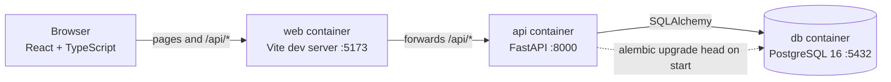
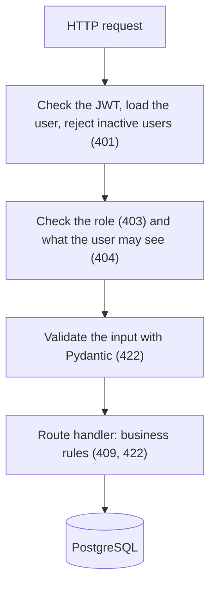

# TicketDesk

[](https://github.com/coutLiKe/ticketdesk/actions/workflows/ci.yml)

TicketDesk is an IT help desk and asset tracker. People report problems as tickets, technicians
work through them, and admins manage the users. Devices are tracked too, so a ticket can point at
the laptop that's causing it.

I built it to practise a real backend: roles and permissions, database migrations, tests, Docker
and a deployment. The stack is FastAPI, PostgreSQL and React.

**Live demo:** https://coutlike.github.io/ticketdesk/
**API docs:** https://ticketdesk-api-idro.onrender.com/docs


**Highlights**
- Permissions are enforced on the server for every endpoint and tested for each role, including
  the cases where access should be refused.
- Hidden records return 404 rather than 403, and the role is read from the database on every
  request, so a deactivated user is locked out immediately.
- Tests run against a real PostgreSQL built from the actual migrations (322 backend tests, 97%
  coverage, plus front-end tests). CI also checks that both Docker images build.
- It is deployed on free tiers (Render, Neon, GitHub Pages) and starts locally with one command.

## Try the demo

The API runs on a free host that goes to sleep when idle, so the first request after a quiet
spell can take up to a minute. After that it's quick.

All demo accounts use the password `demo1234`:

| Role | Email |
|---|---|
| Admin | `admin@ticketdesk.dev` |
| Technician | `tom@ticketdesk.dev`, `tina@ticketdesk.dev` |
| Requester | `rita@ticketdesk.dev`, `raj@ticketdesk.dev`, `rosa@ticketdesk.dev` |

Everything in the demo is made-up data, and the passwords are public, so please don't enter
anything real. You can also register your own account, which starts as a requester.

Things to try: on the login page, the Requester, Technician and Admin buttons fill in a demo
account for you. Log in as Rita and as Tom and compare the same ticket. Tom can see an internal
note that Rita can't, and he can change priority and assignee while she can't.

## What it does

- Three roles: requester, technician and admin. Login uses JWT. Registration always creates a
  requester, and only an admin can change someone's role.
- Tickets can be created, assigned, given a priority and commented on. They move through
  `open`, `in_progress`, `resolved` and `closed`, and a resolved ticket can be reopened. The list
  supports filters, search and paging.
- Technicians can write internal notes that requesters never see.
- Assets (laptops, monitors, phones and so on) can be assigned to people, retired, and linked to
  tickets.

## Run it locally

You need Docker (Docker Desktop or OrbStack). It works on Apple Silicon.

```bash
git clone https://github.com/coutLiKe/ticketdesk.git
cd ticketdesk
cp .env.example .env
docker compose up --build
```

In a second terminal, load the demo data:

```bash
docker compose run --rm seed
```

| What | Where |
|---|---|
| App | http://localhost:5173 |
| API docs | http://localhost:8000/docs |
| Postgres | localhost:5432 (user, password and database are all `ticketdesk`) |

The demo accounts are the same as above. To start over with an empty database, run
`docker compose down -v`.

## How it fits together



The deployed version differs in two ways. The front end is a static build on GitHub Pages and
calls the API directly (so the API allows that origin with CORS). The database is a hosted
PostgreSQL on Neon, and the API runs on Render.

Every request to the API goes through the same steps:



Project layout:

```
backend/
  app/
    main.py          app and router setup
    config.py        settings read from environment variables
    db.py            database engine and session
    models.py        SQLAlchemy models
    schemas.py       Pydantic request and response models
    security.py      bcrypt password hashing and JWT helpers
    deps.py          get_current_user, require_roles
    ticket_rules.py  the ticket status rules
    routers/         auth, users, tickets, comments, assets, ticket_assets
    seed.py          demo data (never run it on a real deployment)
    make_admin.py    promote a registered user to admin
    ratelimit.py     failed-login limiter
    cors.py          CORS setup
  alembic/versions/  database migrations
  tests/             pytest tests, run against a real PostgreSQL
frontend/src/        React app: pages/, components/, api.ts, auth.tsx
docs/                screenshots and deployment notes
scripts/             screenshot generator
```

## Permissions

| Action | Requester | Technician | Admin |
|---|---|---|---|
| Register, log in, see own profile | yes | yes | yes |
| Create a ticket | yes | yes | yes |
| View tickets | own only | all | all |
| Comment on a ticket | own tickets | all | all |
| Write or read internal notes | no | yes | yes |
| Set priority, assign a ticket | no | yes | yes |
| Change ticket status | close or reopen own resolved ticket | any valid move | any valid move |
| View assets | ones assigned to them | all | all |
| Create, edit, assign or retire assets; link them to tickets | no | yes | yes |
| List users, change roles, deactivate users | no | no | yes |

A few details:
- A ticket you aren't allowed to see returns 404 rather than 403, so its existence isn't revealed.
- 401 means you aren't logged in (or the token is bad). 403 means you're logged in but not allowed.
- Closed tickets are final: no new comments and no priority, assignee or asset changes.
- The user's role is read from the database on every request, so a role change or deactivation
  applies immediately, even to tokens that were already issued.

## API

Every endpoint is listed, with request and response shapes, in the interactive docs at
[`/docs`](https://ticketdesk-api-idro.onrender.com/docs). List endpoints return
`{items, total, limit, offset}`.

## Tests and CI

```bash
cd backend
python3 -m venv .venv && .venv/bin/pip install -r requirements-dev.txt
docker compose up -d db                  # the tests need PostgreSQL on localhost:5432
.venv/bin/pytest --cov=app               # 322 tests, about 97% coverage (CI requires 95%)
.venv/bin/ruff check . && .venv/bin/ruff format --check .

cd ../frontend
npm ci && npm run lint && npm test && npm run build
```

- Each endpoint is tested for the normal case, bad input, a missing token (401), the wrong role
  (403) and someone else's data (404).
- The tests use a real PostgreSQL database, not SQLite. The schema is created by running the
  Alembic migrations, so every test run also checks that the migrations work. Each test runs in a
  transaction that gets rolled back.
- One test fails if a model is changed without a matching migration.
- The front end has Vitest and Testing Library tests for the API client, the login page, the
  status-action rules and role-based routing.
- GitHub Actions runs lint and tests for the backend (with a PostgreSQL container and a coverage
  floor), lint, tests and a build for the front end, and a build of both Docker images, on every
  push. A second workflow publishes the front end to GitHub Pages. Dependabot proposes dependency updates monthly.

## Design notes

- All permission checks are on the server. The UI hides buttons people can't use, but that is only
  for convenience.
- Each rule lives in one place: `get_visible_ticket` and `get_visible_asset` decide what a user can
  see, `ticket_rules.py` holds the status rules, and `require_roles` protects endpoints.
- The JWT doesn't contain the role. Looking the user up on each request costs one query, and in
  return a deactivated user is locked out straight away.
- Input and output use separate schemas. The ticket creation schema has no status or requester
  field, so a client can't set them, and the user response has no password field.
- Constraints are also in the database: unique emails and asset tags, `CHECK` constraints on the
  enum columns, and foreign keys with a deliberate `RESTRICT`, `SET NULL` or `CASCADE`.
- Enums are stored as text with a `CHECK` constraint instead of native PostgreSQL enums, which are
  awkward to change in a migration.
- An asset's status follows its assignment and can't be set directly, so it can't say "in stock"
  while someone has it.
- The login token is kept in `localStorage`. That's simple, but a script injected into the page
  could read it. A cookie with the `httpOnly` flag would be safer.

## Limitations

- Locally the front end runs on the Vite dev server. A production setup would serve a built copy
  from something like nginx.
- Migrations run when the API starts. With more than one API instance they should be a separate
  step.
- Search uses `ILIKE`. PostgreSQL full-text search would scale better.
- Tokens last an hour and there are no refresh tokens. The login limiter keeps its counts in
  memory, so it only works for a single instance and resets on restart.
- There are no email notifications, attachments or audit log.
- Status and comment checks read a ticket and then write it without locking, so two simultaneous
  requests could race (for example a comment landing just after a ticket is closed).
- Registering with an address that already exists returns 409, which reveals that the address is
  in use. Sign-ups are rate-limited per address.
- The demo API sleeps when idle, which is a limit of the free plan.

How it is hosted, configured and redeployed is described in [docs/deployment.md](docs/deployment.md).

## More screenshots

| | |
|---|---|
|  |  |
| Technician view of a ticket | The same ticket as a requester, with the internal note hidden |
|  |  |
| Assets | User management (admin) |

To regenerate them, run the app with the demo data and then `node scripts/screenshots.mjs`. It
uses your local Chrome.

## License

MIT. See [LICENSE](LICENSE).
